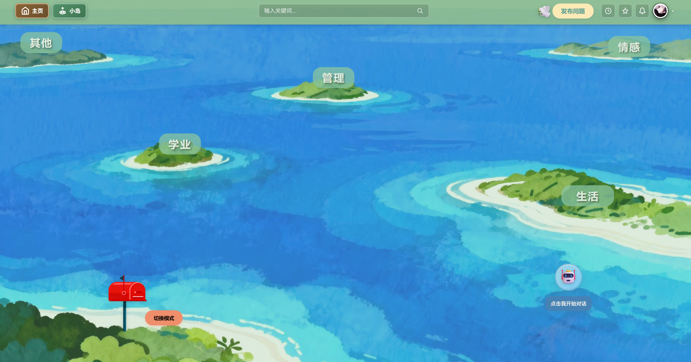
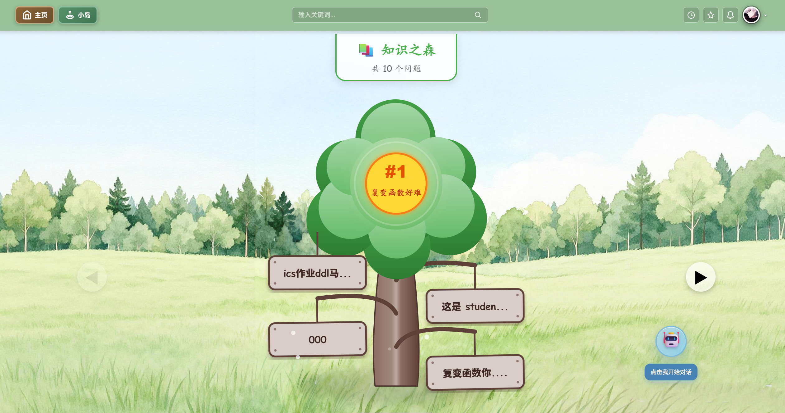
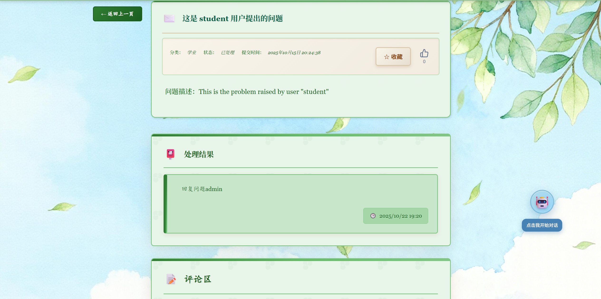

# DoveLink - 多闻林

**Our slogan:** "`Unite, Share, Trust, Connect` —— `Dovelink` 让心声相聚"

## Technology Stack

- 🐍 Django for the Python backend、🗄️ sqlite3 for the Python SQL database

- ⚛️ React + ⚡ Vite for the frontend

- 🔐 JWT (JSON Web Token) authentication.

- 🤖 ChatGPT API integration for enhanced user interaction.

## Project Features

We built this project using a **dual-system** approach, featuring both a concise issue feedback interface and an animated island-style page, providing users with rich exploration experiences.

### Register Page

### Login Page

### Default Mode

---

#### StudentDashboard

#### IssueDetail

#### IssueSubmit

### Island Mode

---

#### Home Page

#### Topic-tree

#### IssueDetail

#### IssueSubmit

> Note: The two modes share the same IssueSubmit page.

### AdminDashboard

## How To Use It

Just **fork or clone** this repository and it will work.

## Frontend Development

Frontend docs: [frontend/README.md](https://github.com/KevinJustin-love/CampusFeedbackSystem/blob/main/frontend/README.md)

## Backend Development

Backend docs: [backend/README.md](https://github.com/KevinJustin-love/CampusFeedbackSystem/blob/main/backend/README.md)
