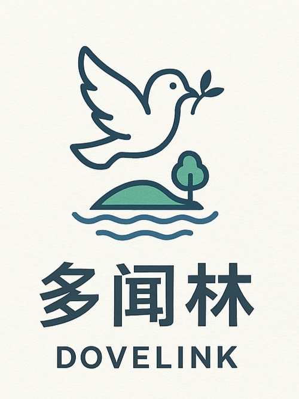
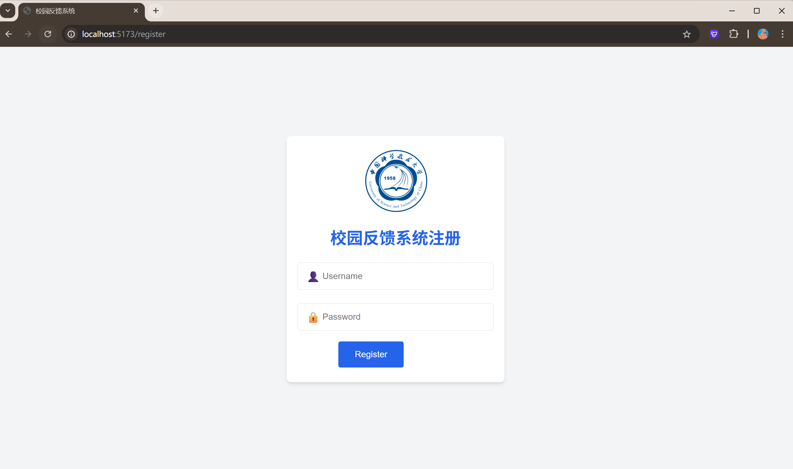
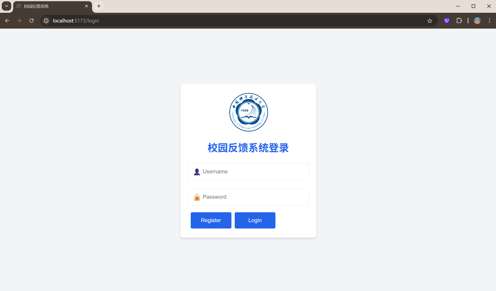
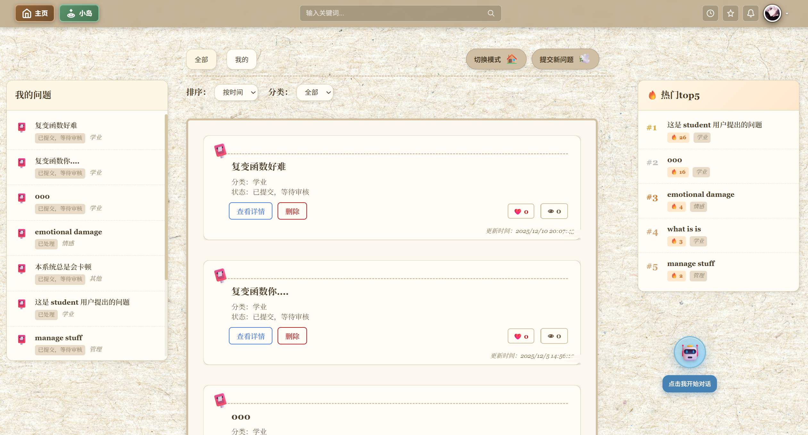
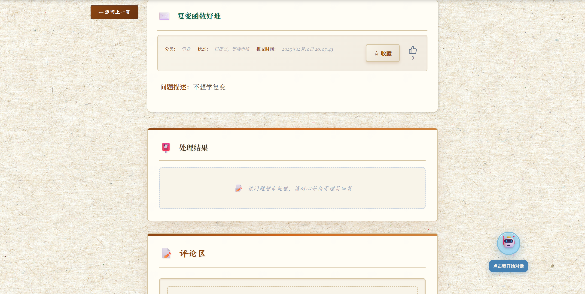
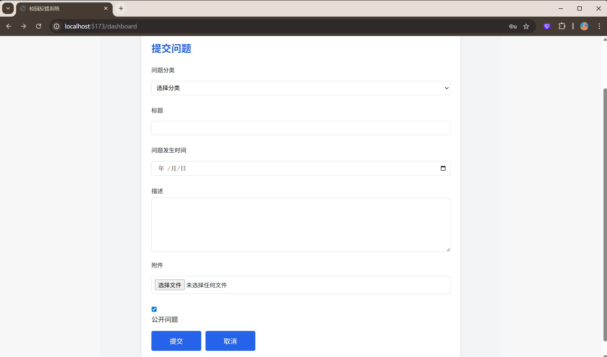
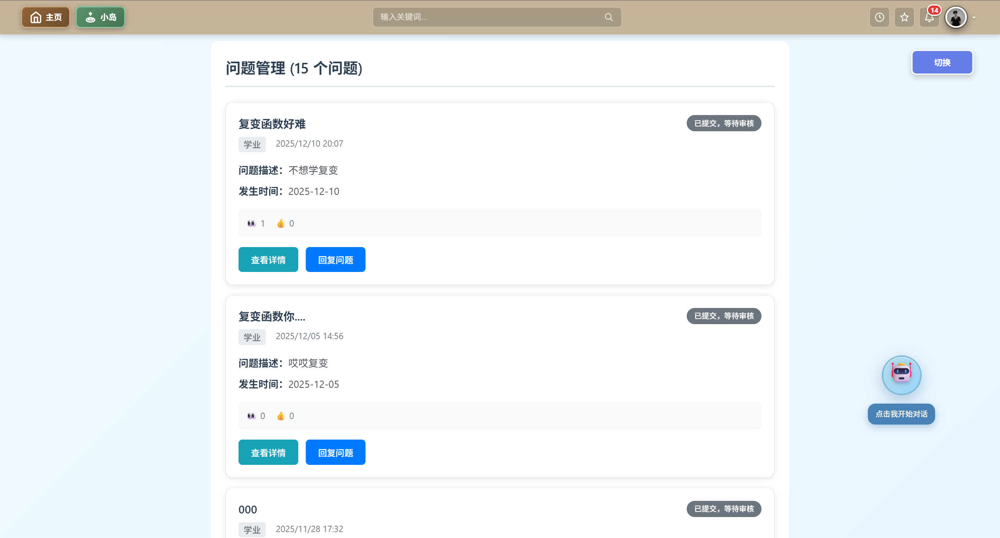

# DoveLink - 多闻林

**Our slogan:** "`Unite, Share, Trust, Connect` —— `Dovelink` 让心声相聚"

## Technology Stack and Features

- Django for the Python backend、sqlite3 for the Python SQL database

- React + Vite for the frontend

- JWT (JSON Web Token) authentication.

### Register Page

### Login Page

### StudentDashboard

### IssueDetail

### IssueSubmit

### AdminDashboard

## How To Use It

Just **fork or clone** this repository and it will work.

## Frontend Development

Frontend docs: frontend/README.md

## Backend Development

Backend docs: backend/README.md

## Cooperation Guidelines

Plz strictly obey the following content for our collaboration.

https://www.xiaohongshu.com/discovery/item/685c6bde0000000017034db9?source=webshare&xhsshare=pc_web&xsec_token=AB5dxMlZK-w-R0bJZu0Mzmi1h2O4BMq83E40MoNGwEGXo=&xsec_source=pc_share。

⚠ When the teammate makes a new `feature`, it is supposed to merge the code locally through `develop` branch, and fix the consequent code conflicts.
