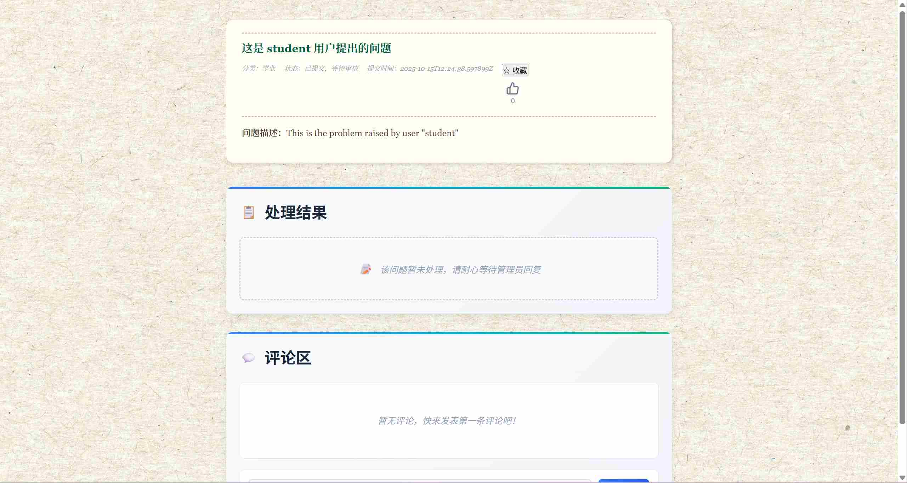
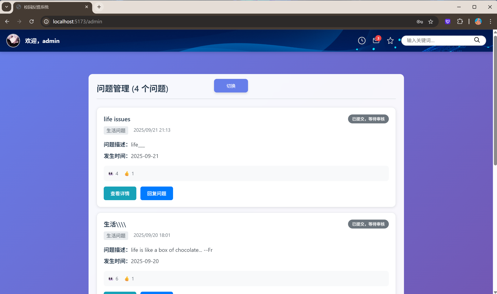

# DoveLink - 多闻林

**Our slogan:** "`Unite, Share, Trust, Connect` —— `Dovelink` 让心声相聚"

## Technology Stack and Features

- 🐍 Django for the Python backend、🗄️ sqlite3 for the Python SQL database

-  ⚛️ React + ⚡ Vite for the frontend

- 🔐 JWT (JSON Web Token) authentication.

### Register Page

### Login Page

### Home Page

### Topic-tree

### StudentDashboard

### IssueDetail

### IssueSubmit

### AdminDashboard

## How To Use It

Just **fork or clone** this repository and it will work.

## Frontend Development

Frontend docs: [frontend/README.md](https://github.com/KevinJustin-love/CampusFeedbackSystem/blob/main/frontend/README.md)

## Backend Development

Backend docs: [backend/README.md](https://github.com/KevinJustin-love/CampusFeedbackSystem/blob/main/backend/README.md)

## 部署到 dovelink.com

需要上线到正式域名时，可参考中文部署手册：[DEPLOYMENT_CN.md](./DEPLOYMENT_CN.md)。

## Cooperation Guidelines

Plz strictly obey the following content for our collaboration.

https://www.xiaohongshu.com/discovery/item/685c6bde0000000017034db9?source=webshare&xhsshare=pc_web&xsec_token=AB5dxMlZK-w-R0bJZu0Mzmi1h2O4BMq83E40MoNGwEGXo=&xsec_source=pc_share。

⚠ When the teammate makes a new `feature`, it is supposed to merge the code locally through `develop` branch, and fix the consequent code conflicts.
